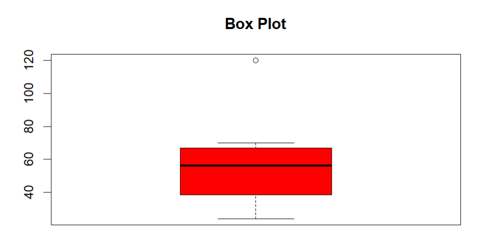

# PART A

#### 8. Write a R program for any visual representation of an object with creating graphs functions: plot(), hist(), linechart(), pie(), boxplot(), scatterplot().

```{r}

# Create a sample dataset

data <- c(24, 45, 56, 24, 56, 44, 33, 68, 66, 70, 120, 59)
```

```{r}

# Create a basic line chart 

plot(data, type = "l", col = "blue", xlab = "X axis", ylab = "y axis", main = "Line Chart")
```


```{r}

# Create a histogram

hist(data, col = "lightgreen", xlab = "Value", ylab = "Frequency", main = 'Histogram')
```


```{r}

# Create a pie chart

pie.data <- c(20,30,40,10)

pie(pie.data, labels = c("A", "B", "C", "D"), col = rainbow(length(pie.data)), main = "Pie Chart")
```


```{r}

# Create a boxplot

boxplot(x = data, col = "red", xlab = "Value", main = "Box Plot")
```



```{r}

# Create a scatterplot

x <- c(1,2,3,4,5,6,7,8,9,10)
y <- c(2,4,5,7,8,10,11,14,15,17)

plot(x, y, col = "magenta", xlab = "X data", ylab = "Y data", main = "Scatterplot")
```


